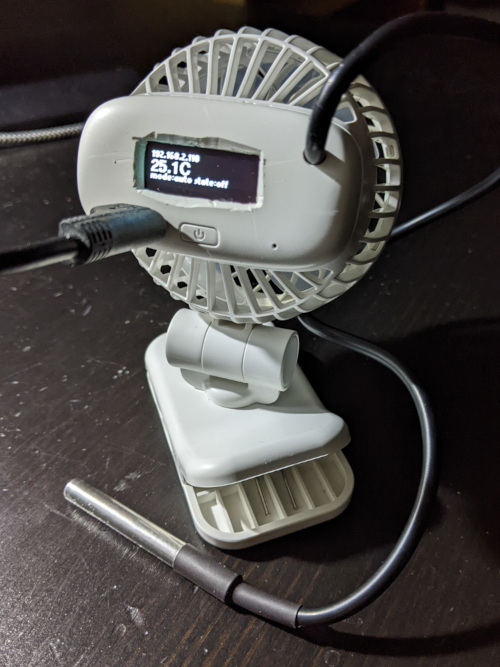
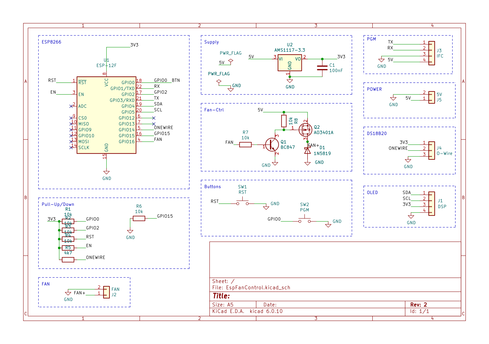
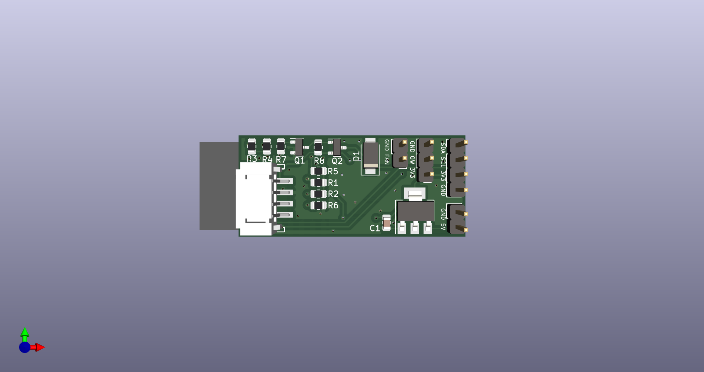
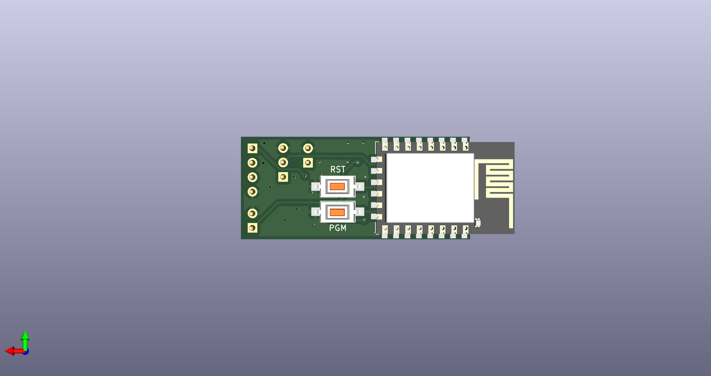

# EspFanControl
## ESP8266, DS18B20, USB-Fan, SSD1306

## Project goals:
* temperature-controlling of fan
* show status on display
* export status on mqtt
* web interface for setup
* fit into cheap USB/Lipo Fan

## Items on store:
* ESP8266 microcontroller with wifi
* DS18B20 temperature sensor
* SSD1306 OLED Display (128x64)

## FAN:

## Schema:

## PCB:

